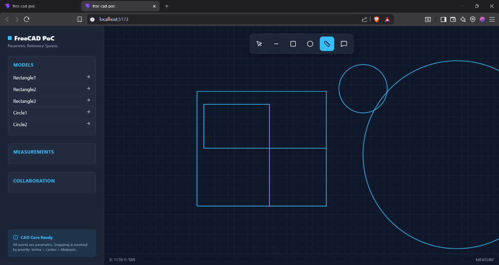
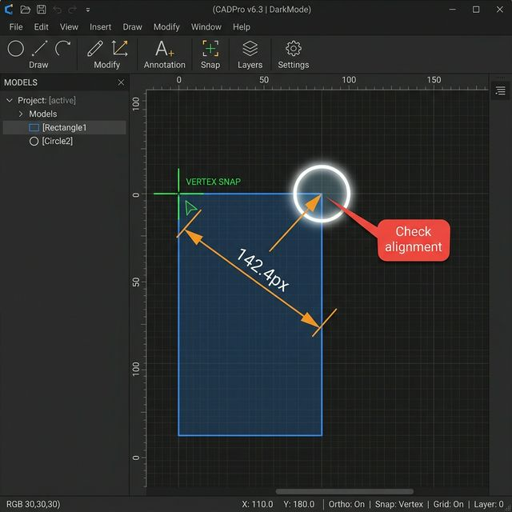

# GSoC 2026 Proposal: Unifying Snapping, Measurement, and Collaboration in FreeCAD

## 🥇 Section 1 — My Prototype

I built a working Parametric CAD + Collaboration prototype to understand how snapping, measurement, and interaction behave when modeled as references instead of coordinates.

In my prototype, every shape (Line, Circle, Rectangle) isn't just a collection of X-Y values. Instead, the system resolves them into **semantic references** like `Circle1@center` or `Rect2@top_left`. This is the core of "parametric thinking."

**Figure 1: My working prototype showing basic shapes, the snapping crosshair, and the property sidebar.**

While building this, I realized that the "snapping" isn't just a UI helper—it's the **Identity Resolver**. When I hover over a corner, the system isn't just finding a point; it's identifying a *source*. This allowed me to implement a **Priority-Based Snapping System** (Vertex > Center > Midpoint), which makes the canvas feel much more intentional and less jittery.

What I noticed was that once you have a stable reference, everything else becomes "free." For example, I implemented a measurement engine that stores two references (e.g., `Rect1@p1` and `Circle1@center`) instead of a distance value. Because the system resolves these references every frame, I can move the rectangle in the sidebar and the measurement updates itself instantly.

**Figure 2: Prototype validation showing the 'chain of intent': Snap → Measure → Annotation.**

This diagram proves the stability of the model. I added an **Annotation System** where users can pin a comment like "Check alignment" directly to a snap point. Because the comment is anchored to `Circle2@center` and not to a pixel on the screen, the comment follows the circle as its parameters change. This is exactly what’s missing in many collaborative CAD workflows today.

---

## 🧠 Section 2 — Problem Understanding

What I noticed while building the prototype is that the problem is not just missing features — it's that these systems don’t share a common underlying model.

Working on this PoC helped me pinpoint why FreeCAD sometimes feels inconsistent during complex edits. Currently, snapping, measurement (Issue #13708), and annotations often behave like isolated features. 

When you snap a measurement in many tools, it often "drops" the relationship after the initial click. If the underlying geometry moves, the measurement doesn't always follow, or worse, it follows a coordinate that no longer makes sense. The snapping also lacks a clear priority model, which I found leads to "selection fatigue" in dense models.

By building my own engines for this, I realized the data logic is often too coupled with the coordinate system. We need a way to let the **intent** (the snap point) drive the metadata (measurements/comments).

---

## ⚙️ Section 3 — Proposed Solution

My proposal is to unify these systems under a **Reference-Based Model**. Instead of treating them as separate tasks, we should treat them as different interactions on the **same underlying references**. 

**The Key Idea:** A snap point is the birth of a reference. A measurement is just a distance between two references. An annotation is just a comment attached to a reference.

By implementing a "reference resolver" similar to what I did in my `MeasurementEngine.js`, we can ensure that as the App layer updates the geometry, the UI layer (measurements/annotations) remains 100% synchronized because they are pointing to a stable identity, not a static number.

This shifts the system from being event-driven (click → compute) to being reference-driven (resolve → update).

---

## 🏗️ Section 4 — Technical Design (FreeCAD Mapping)

The goal is to carefully integrate this model into FreeCAD’s existing architecture without disrupting current workflows.

1.  **Geometry Layer (App/Core)**: This corresponds to my `GeometryEngine`. It's the source of truth for parametric data.
2.  **Selection Pipeline (View/Gui)**: My `SnapManager` would fit into the selection and snapping routines. I plan to refine the `ViewProvider` logic to expose semantic points more clearly.
3.  **Measure Module**: Instead of calculating "on-click," this would use my `MeasurementEngine` logic to store `ReferenceA + ReferenceB` pairs that re-resolve during the View update loop.
4.  **UI/Annotation Layer**: This is a potential future extension where we can store user-generated metadata (comments) linked to the `Object@InternalName` reference.

---

## 📅 Section 5 — Implementation Plan

I want to keep this realistic. FreeCAD is a huge codebase, and my first goal is to ensure stability.

-   **Phase 1 (Weeks 1-3)**: Deep-dive into the existing C++ selection and snapping code. I need to see how `Point` and `Curve` snapping is currently handled and where the "bottlenecks" for reference-storing reside.
-   **Phase 2 (Weeks 4-6)**: Implement a refined **Priority Snapping** model (based on my PoC's Vertex > Center logic). This will improve the "feel" of the tool immediately.
-   **Phase 3 (Weeks 7-9)**: Develop the **Reference-Based Measurement** core. The goal is to allow measurements to persist through geometry updates.
-   **Phase 4 (Weeks 10-12)**: Integration and testing. I'll add the basic **Annotation/Comment** markers and ensure the UI doesn't clutter during complex assemblies.

Each phase will be validated incrementally to avoid introducing instability into the core system. I am committed to dedicating **30-35 hours per week** to this project to ensure we hit every milestone without compromise.

---

## 👨💻 Section 6 — Why Me

I didn’t just analyze this problem — I built a working system to explore it. I’m not just a developer; I’m someone who actually uses CAD. I didn't just read the issues—I built a working prototype to test my ideas.
 I already understand the tradeoffs: for example, re-resolving references every frame can be expensive, and I’ve already started thinking about how to optimize this through lazy-evaluation (which I experimented with in my `refreshEngineState` logic).

I’ve spent the last week digging through the FreeCAD issue tracker and community discussions. I’m ready to put in the work to turn my prototype into a core feature.

---

## 🔮 Section 7 — Future Work

-   **Constraint Solver**: The next logical step is to let these references **control** the geometry. If I change a measurement from 100mm to 120mm, the reference system should tell the solver to update the shape.
-   **3D Expansion**: Bringing the semantic snapping to 3D volumes (snapping to faces, axes, and centroids).
-   **Real-time Collaboration**: Using the reference system to sync edits across multiple users without worrying about coordinate drifts.

---

## 📚 Section 8 — References

-   **FreeCAD Repository**: [github.com/FreeCAD/FreeCAD](https://github.com/FreeCAD/FreeCAD)
-   **FreeCAD Issue #13708**: [Add snapping to measurements / picking points](https://github.com/FreeCAD/FreeCAD/issues/13708)
-   **My Working Prototype**: [github.com/Aaravanand00/Free-CAD-POC](https://github.com/Aaravanand00/Free-CAD-POC)
-   **Wikipedia**: Parametric Design Principles
